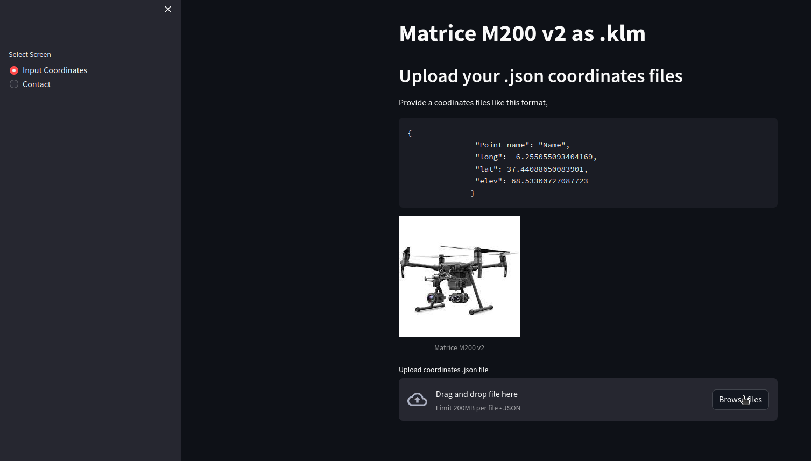
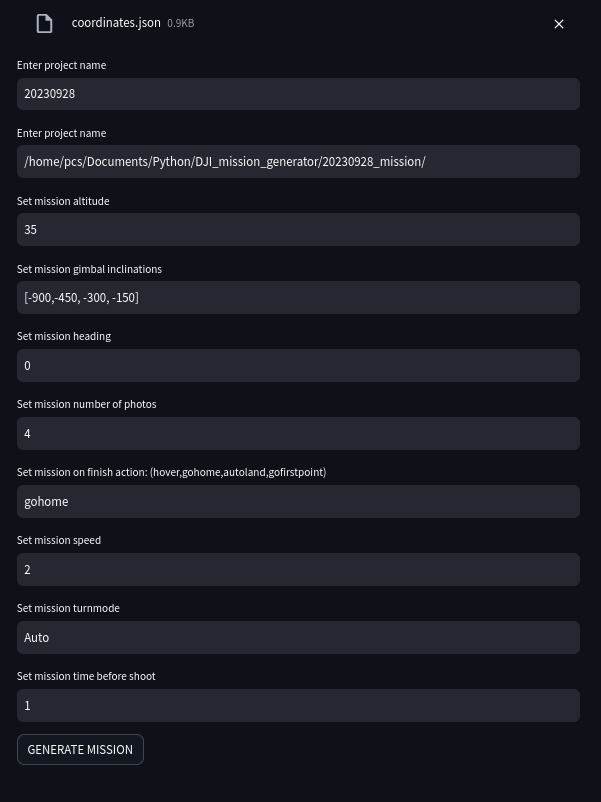

# References:

This is a fork  from [IPGP/waypoints_generator](https://github.com/IPGP/waypoints_generator) to use dict2djikml.py function and generate the XLM structure of a DJI pilot mission .klm

---

## About this app (BETA)

As DJI UAV Matrice 200 V2 user:

Waypoints mission planning must be created DJI Pilot app with remote control.

Each waypoint and actions need to be inserted manually in app using the touch screen.

This app allows you to create a .klm mission plan for DJI Pilot with actions configurable actions over a streamlit gui interface at desktop.

### Input data

#### .Json Coordinates file.

- Upload a coordinates file with this format:

```json
[
    {
        "Point_name": "Waypoint1",
        "long": -6.255055093404169,
        "lat": 37.44088650083901,
        "elev": 68.53300727087723
    },
    {
        "Point_name": "Waypoint2",
        "long": -6.255035028833104,
        "lat": 37.44105258155864,
        "elev": 68.74336339170866
    },
    {
        "Point_name": "Waypoint3",
        "long": -6.254998040077886,
        "lat": 37.44112206017867,
        "elev": 67.9041242659761
    },
]
  
```



- After upload, set mission variables:
    Enter project name
    Enter project name
    Set mission altitude
    Set mission gimbal inclinations
    Set mission heading
    Set mission number of photos
    Set mission on finish action: (hover,gohome,autoland,gofirstpoint)
    Set mission speed
    Set mission turnmode
    Set mission time before shoot



- Generate Mission:

Create a mission .klm with DJI Pilot format copyu this file in your remote controller via USB stick or card to launch your automated fly.

Also a .html file with a route map preview is created at your project directory.

#### __~~Google maps .kml file~~__ (for feature version)

```
# How to use locally this app

## Python 3 Requirements

pip install -r requirements.txt

### Google Earth .klm

- In [Google Earth](https://earth.google.com/web/) click the ``
- Click "New project" and select "Create a KML file" or "Create in Google Drive"
- Click "New element" and "Draw a line or shape"
- Create the shape and double clik on the first point to close the path.
- It is not possible to remove point from a shape. A new shape needs to be draw
- Exit the “New element" by clicking the top left arrow
- Click `` to export the kml file
```
